# Praxis Agent Carbon Platform - Architecture Diagrams

This document provides detailed architecture diagrams showing how all components interact within the Praxis Agent Carbon Platform.

---

## 🏛️ High-Level Platform Architecture

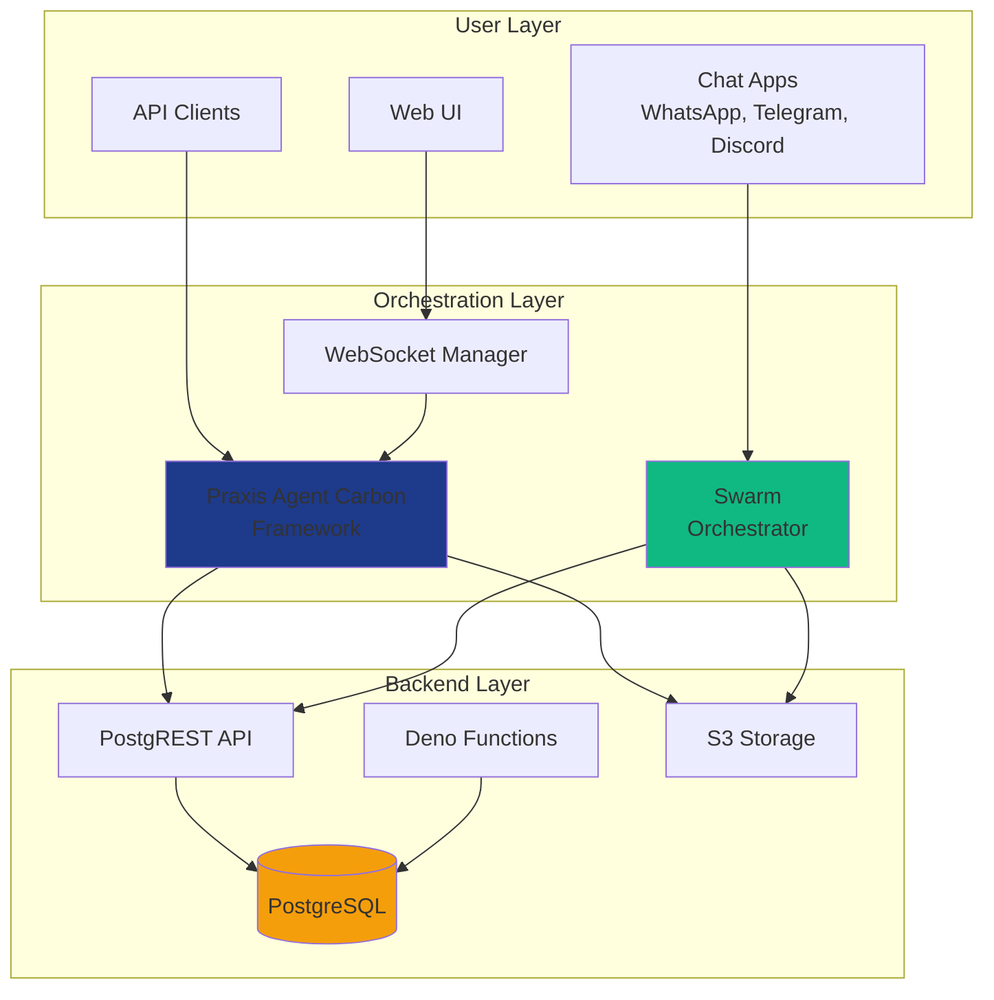

---

## 🔄 Data Flow Architecture

### 1. User Message Flow

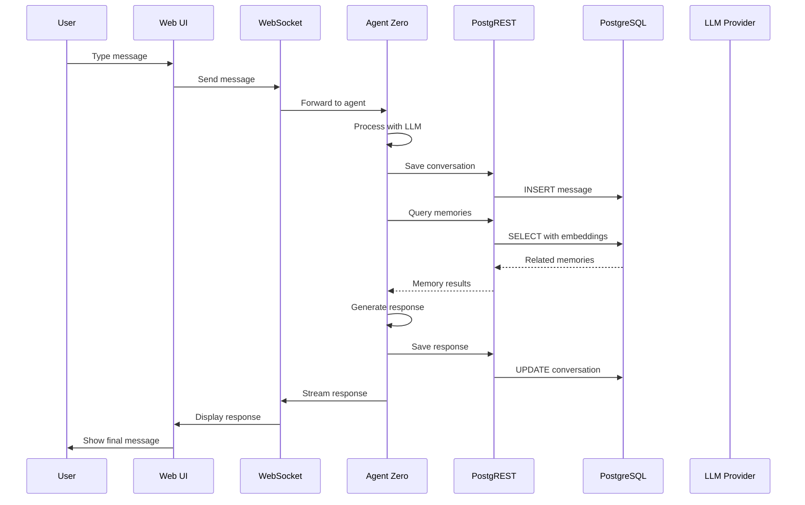

### 2. Swarm Channel Message Flow

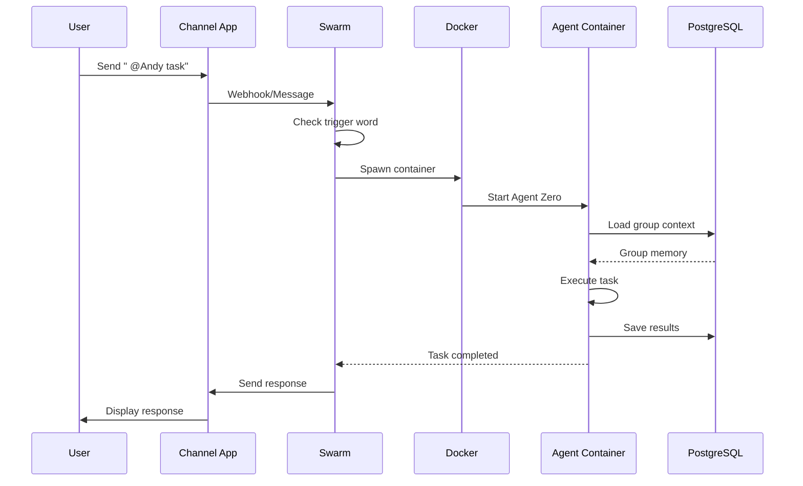

### 3. Scheduled Task Execution Flow

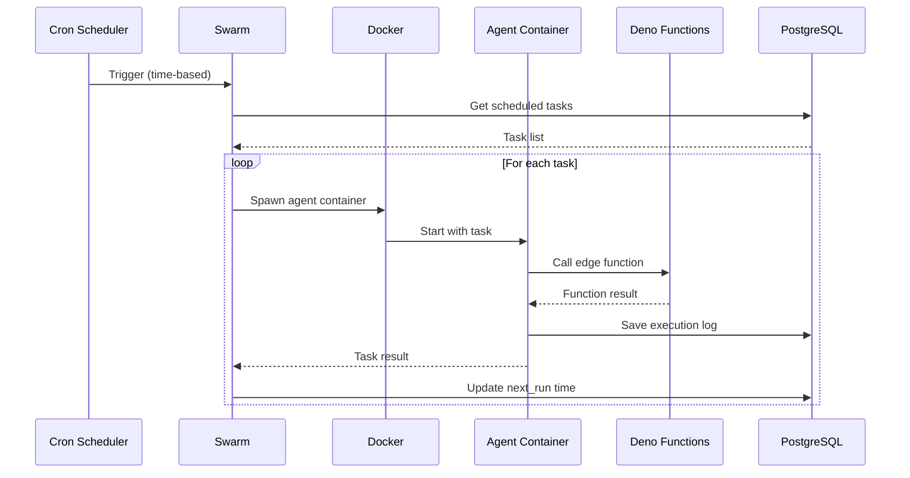

---

## 🏗️ Component Architecture

### InsForge Backend Architecture

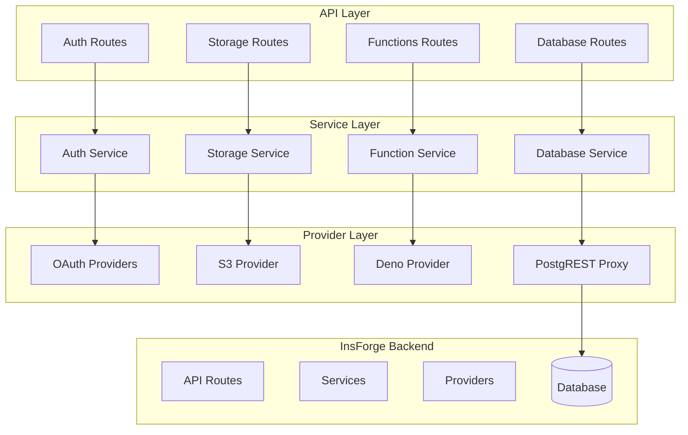

### Agent Zero Architecture

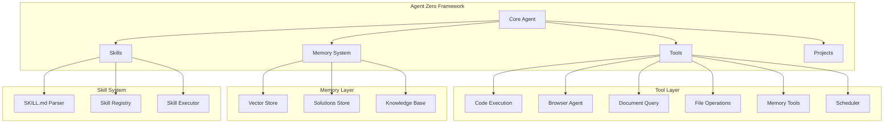

### Swarm Architecture

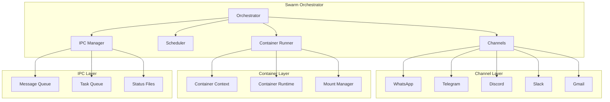

---

## 🔐 Security Architecture

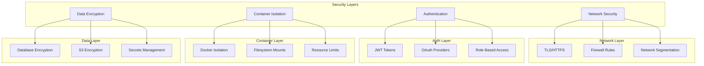

---

## 📊 Data Storage Architecture

```mermaid
graph TB
    subgraph "Storage Systems"
        PG[(PostgreSQL)]
        S3[S3 Storage]
        FS[File System]
        VEC[Vector Store]
    end
    
    subgraph "PostgreSQL Data"
        PG1[Users & Auth]
        PG2[Agent Configs]
        PG3[Memories]
        PG4[Conversations]
        PG5[Swarm Groups]
        PG6[Scheduled Tasks]
    end
    
    subgraph "S3 Storage"
        S31[File Uploads]
        S32[Function Artifacts]
        S33[Backups]
    end
    
    subgraph "File System"
        FS1[Agent Workspaces]
        FS2[Group Directories]
        FS3[IPC Files]
    end
    
    subgraph "Vector Store"
        VEC1[pgvector Tables]
        VEC2[Embeddings]
        VEC3[Similarity Search]
    end
    
    PG --> PG1
    PG --> PG2
    PG --> PG3
    PG --> PG4
    PG --> PG5
    PG --> PG6
    
    S3 --> S31
    S3 --> S32
    S3 --> S33
    
    FS --> FS1
    FS --> FS2
    FS --> FS3
    
    VEC --> VEC1
    VEC --> VEC2
    VEC --> VEC3
```

---

## 🚀 Deployment Architecture

### Local Development

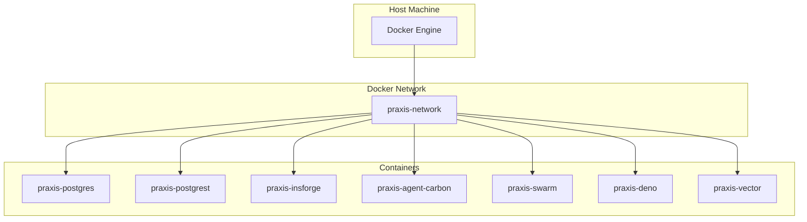

### Production Deployment (Railway)

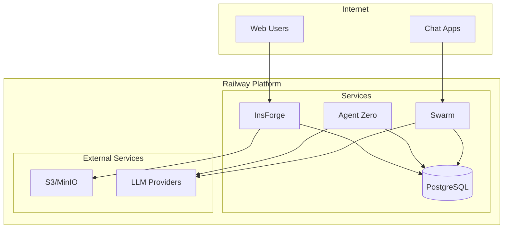

---

## 🔄 State Management Architecture

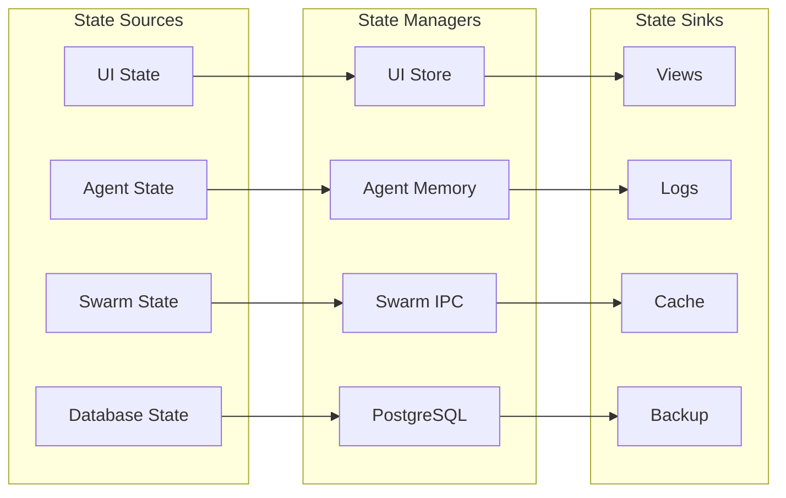

---

## 🧪 Testing Architecture

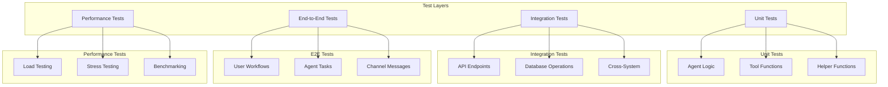

---

## 📈 Monitoring & Observability Architecture

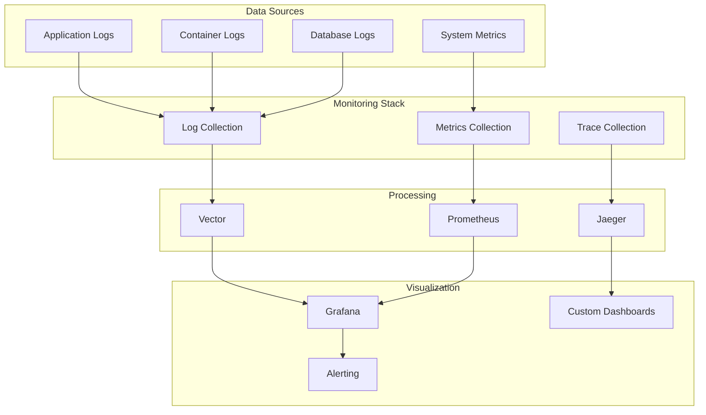

---

## 🎯 Component Interaction Matrix

| Component | InsForge | Agent Zero | Swarm | PostgreSQL | S3 |
|-----------|----------|------------|-------|------------|-----|
| **InsForge** | ✅ | API, Auth, DB | API, Auth, DB | Read/Write | Read/Write |
| **Agent Zero** | API, Auth | ✅ | Delegation | Read/Write | Read/Write |
| **Swarm** | API, Auth | Container Spawn | ✅ | Read/Write | Read/Write |
| **PostgreSQL** | Persistence | Persistence | Persistence | ✅ | N/A |
| **S3** | File Storage | File Storage | File Storage | N/A | ✅ |

---

## 🔄 Communication Protocols

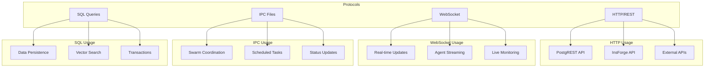

---

## 🎨 UI/UX Architecture

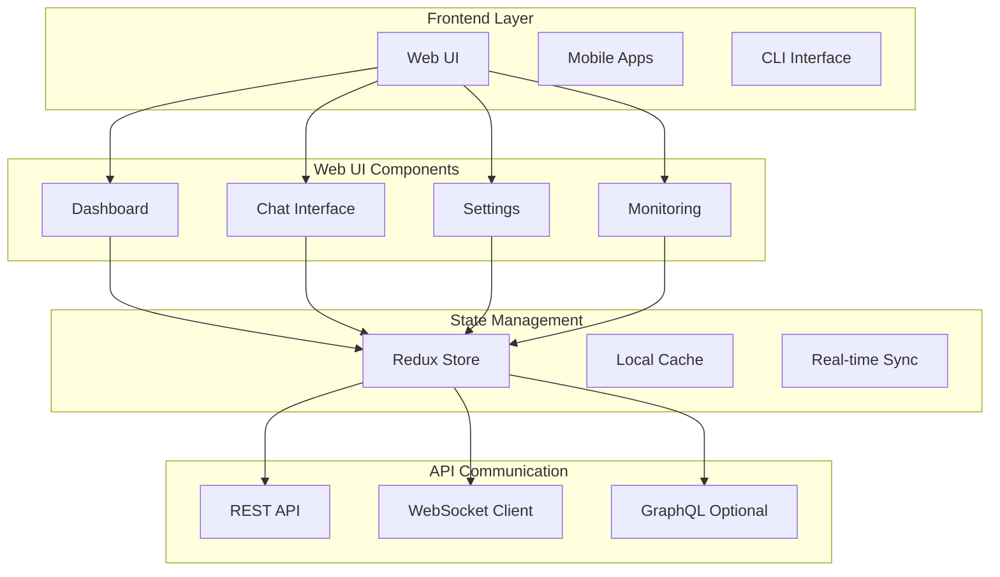

---

  
Architecture is not just about components

  
It's about how they work together to create something greater

  
<strong>The Praxis Agent Carbon Platform</strong>

