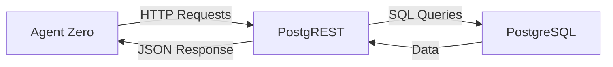
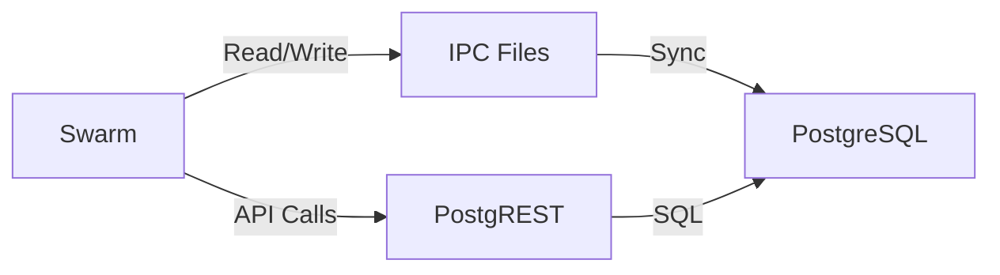
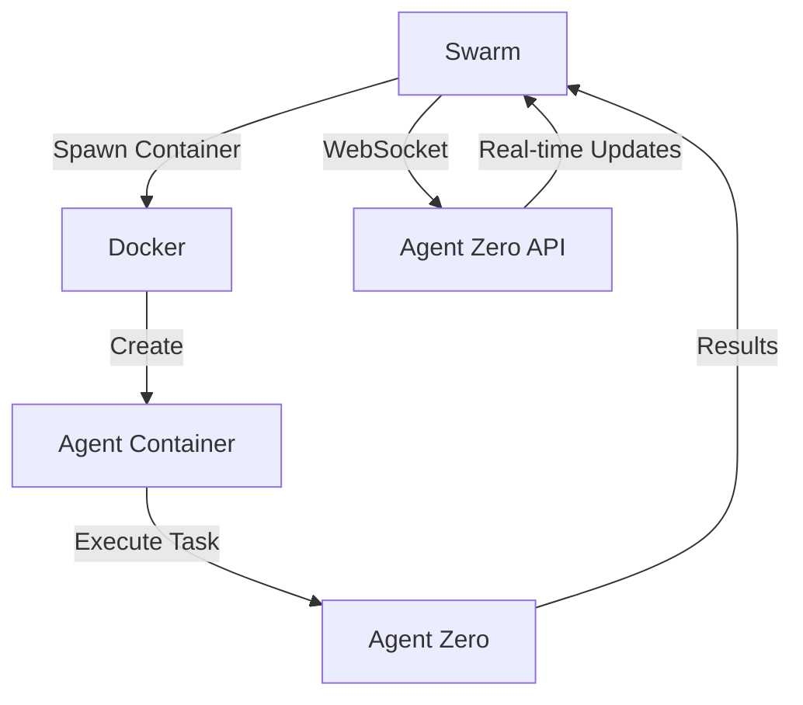
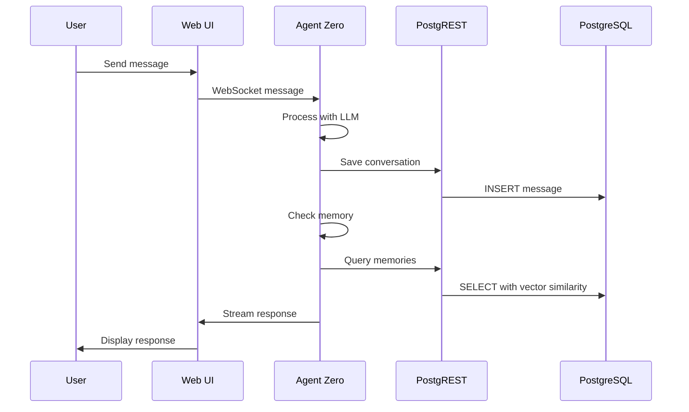
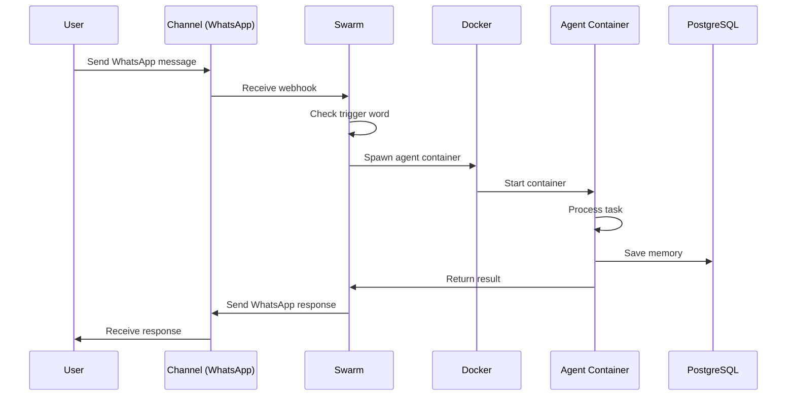
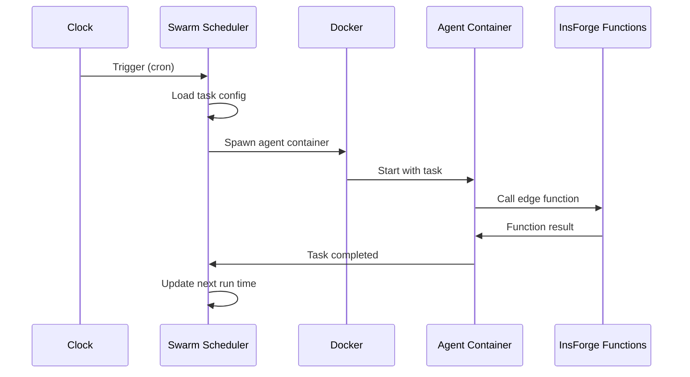
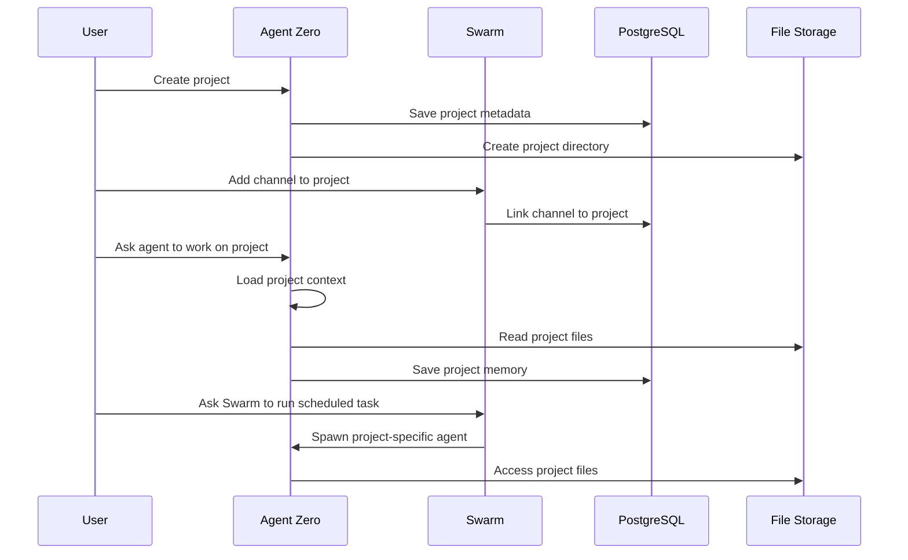

# Praxis Agent Carbon Platform - Integration Guide

This guide explains how the three main components (InsForge, Praxis Agent Carbon, and Swarm) work together and how to integrate them effectively.

---

## 🏗️ System Architecture Overview

```
┌──────────────────────────────────────────────────────────────────────┐
│                          USER LAYER                                   │
│  ┌─────────────┐  ┌─────────────┐  ┌─────────────┐                 │
│  │   Web UI    │  │ Chat Apps   │  │  API Client │                 │
│  │  (InsForge) │  │  (Swarm)    │  │ (Agent Zero)│                 │
│  └──────┬──────┘  └──────┬──────┘  └──────┬──────┘                 │
└─────────┼─────────────────┼─────────────────┼───────────────────────┘
          │                 │                 │
┌─────────┼─────────────────┼─────────────────┼───────────────────────┐
│         ▼                 ▼                 ▼                       │
│                      ORCHESTRRATION LAYER                            │
│  ┌─────────────┐  ┌─────────────┐  ┌─────────────┐                 │
│  │   Swarm     │  │ Agent Zero  │  │  WebSocket  │                 │
│  │ Orchestrator│  │  Framework  │  │   Manager   │                 │
│  └──────┬──────┘  └──────┬──────┘  └──────┬──────┘                 │
└─────────┼─────────────────┼─────────────────┼───────────────────────┘
          │                 │                 │
┌─────────┼─────────────────┼─────────────────┼───────────────────────┐
│         ▼                 ▼                 ▼                       │
│                     BACKEND LAYER (InsForge)                        │
│  ┌─────────────┐  ┌─────────────┐  ┌─────────────┐                 │
│  │ PostgreSQL  │  │  PostgREST  │  │  Deno Funcs │                 │
│  │ + Auth      │  │   API       │  │   Runtime   │                 │
│  └─────────────┘  └─────────────┘  └─────────────┘                 │
└──────────────────────────────────────────────────────────────────────┘
```

---

## 🔗 Component Integration Points

### 1. InsForge ↔ Praxis Agent Carbon

**Connection:** PostgreSQL + PostgREST API

**Data Flow:**


**Integration Points:**
- **Authentication**: Agent Zero uses InsForge's JWT tokens
- **User Management**: Agent stores users in InsForge database
- **Memories**: Agent memories stored in PostgreSQL with vector embeddings
- **Projects**: Project metadata and configurations in database
- **Conversations**: Chat history persisted through InsForge API

**API Usage:**
```python
# Example: Agent Zero saving memory via InsForge API
import requests

def save_memory(content, embedding, metadata):
    response = requests.post(
        'http://postgrest:3000/memories',
        json={
            'content': content,
            'embedding': embedding,
            'metadata': metadata
        },
        headers={'Authorization': f'Bearer {jwt_token}'}
    )
    return response.json()
```

---

### 2. InsForge ↔ Swarm

**Connection:** PostgreSQL + IPC (Inter-Process Communication)

**Data Flow:**


**Integration Points:**
- **Group Management**: Swarm groups stored in database
- **Message History**: Channel messages persisted via InsForge
- **Scheduled Tasks**: Task configurations in database
- **User Authentication**: Swarm uses InsForge JWT for auth
- **Storage**: Swarm uses InsForge storage for file uploads

**Shared Resources:**
```typescript
// Swarm accessing shared database
import { Database } from 'better-sqlite3';

const db = new Database('/workspace/ipc/swarm.db');

// Sync with InsForge PostgreSQL
async function syncWithInsForge() {
    const groups = db.prepare('SELECT * FROM groups').all();
    
    for (const group of groups) {
        await fetch('http://postgrest:3000/swarm_groups', {
            method: 'POST',
            headers: {
                'Authorization': `Bearer ${process.env.JWT_TOKEN}`,
                'Content-Type': 'application/json'
            },
            body: JSON.stringify(group)
        });
    }
}
```

---

### 3. Praxis Agent Carbon ↔ Swarm

**Connection:** Docker + WebSocket + Shared Filesystem

**Data Flow:**


**Integration Points:**
- **Container Orchestration**: Swarm spawns Agent Zero containers
- **Task Delegation**: Swarm can delegate complex tasks to Agent Zero
- **Memory Sharing**: Both systems access shared memory storage
- **Skill Discovery**: Agent Zero skills can be used by Swarm agents
- **Project Coordination**: Swarm can create projects for Agent Zero

**Container Spawning:**
```typescript
// Swarm spawning an Agent Zero container
import Docker from 'dockerode';

const docker = new Docker();

async function spawnAgent(groupName: string, task: string) {
    const container = await docker.createContainer({
        Image: 'praxis-agent-carbon:latest',
        Env: [
            `TASK=${task}`,
            `GROUP_NAME=${groupName}`,
            `POSTGRES_HOST=postgres`,
            `JWT_SECRET=${process.env.JWT_SECRET}`
        ],
        HostConfig: {
            Binds: [
                '/workspace/groups/${groupName}:/workspace/group:rw',
                '/workspace/global:/workspace/global:rw'
            ]
        }
    });
    
    await container.start();
    return container;
}
```

---

## 🔄 Complete Workflows

### Workflow 1: User Chat via Web UI



**Implementation:**
```javascript
// Web UI sending message to Agent Zero
const ws = new WebSocket('ws://localhost:7130/ws');

ws.send(JSON.stringify({
    type: 'message',
    content: 'Help me analyze this data',
    conversationId: 'uuid-here',
    userId: 'user-uuid'
}));

// Agent Zero processing
ws.on('message', async (data) => {
    const message = JSON.parse(data);
    
    // Save via InsForge API
    await fetch('http://postgrest:3000/conversations', {
        method: 'POST',
        headers: {
            'Authorization': `Bearer ${jwtToken}`,
            'Content-Type': 'application/json'
        },
        body: JSON.stringify({
            agent_id: agentId,
            user_id: userId,
            messages: [message]
        })
    });
});
```

---

### Workflow 2: Channel Message via Swarm



**Implementation:**
```typescript
// Swarm handling WhatsApp webhook
app.post('/webhook/whatsapp', async (req, res) => {
    const message = req.body;
    
    // Check for trigger word
    if (message.content.startsWith(triggerWord)) {
        const task = message.content.replace(triggerWord, '').trim();
        
        // Spawn agent container
        const container = await spawnAgent('whatsapp-group', task);
        
        // Wait for result
        const result = await waitForContainer(container);
        
        // Send response via WhatsApp
        await sendWhatsAppMessage(result);
    }
    
    res.sendStatus(200);
});
```

---

### Workflow 3: Scheduled Task Execution



**Implementation:**
```typescript
// Swarm scheduler
cron.schedule('0 9 * * 1', async () => {
    // Get scheduled tasks
    const tasks = db.prepare(`
        SELECT * FROM scheduled_tasks
        WHERE enabled = true
        AND next_run <= datetime('now')
    `).all();
    
    for (const task of tasks) {
        // Spawn agent to execute task
        const container = await spawnAgent(
            task.group_id,
            task.task_prompt
        );
        
        // Update next run time
        const nextRun = getCronNextRun(task.schedule);
        db.prepare(`
            UPDATE scheduled_tasks
            SET next_run = ?, last_run = datetime('now')
            WHERE id = ?
        `).run(nextRun, task.id);
    }
});
```

---

### Workflow 4: Cross-System Project Management



**Implementation:**
```python
# Agent Zero creating a project
def create_project(name, description, instructions):
    # Save to database via InsForge
    response = requests.post(
        'http://postgrest:3000/projects',
        json={
            'user_id': current_user_id,
            'name': name,
            'description': description,
            'instructions': instructions
        },
        headers={'Authorization': f'Bearer {jwt_token}'}
    )
    
    project = response.json()
    
    # Create project directory
    project_path = f'/workspace/projects/{project["id"]}'
    os.makedirs(project_path, exist_ok=True)
    
    # Save .a0proj metadata
    with open(f'{project_path}/.a0proj', 'w') as f:
        json.dump({
            'project_id': project['id'],
            'name': name,
            'created_at': datetime.now().isoformat()
        }, f)
    
    return project
```

---

## 🔌 Configuration Integration

### Shared Environment Variables

```bash
# .env file (shared across all components)

# Database (shared)
POSTGRES_HOST=postgres
POSTGRES_PORT=5432
POSTGRES_USER=postgres
POSTGRES_PASSWORD=postgres
POSTGRES_DB=praxis_agent_carbon

# Authentication (shared)
JWT_SECRET=shared-secret-key-32-chars-minimum
ENCRYPTION_KEY=encryption-key-32-chars-minimum

# API URLs
POSTGREST_BASE_URL=http://postgrest:3000
INSFORGE_API_URL=http://insforge:7130
AGENT_ZERO_API_URL=http://praxis-agent-carbon:50080

# Storage (shared)
AWS_ACCESS_KEY_ID=xxx
AWS_SECRET_ACCESS_KEY=xxx
AWS_S3_BUCKET=praxis-agent-carbon

# Agent Zero specific
AGENT_ZERO_MODEL=claude-opus-4-1-20250805
AGENT_ZERO_MAX_SUBAGENTS=5

# Swarm specific
SWARM_TRIGGER_WORD=@Andy
SWARM_DEFAULT_MODEL=claude-opus-4-1-20250805
```

### Database Integration

All three systems share the same PostgreSQL database:

```sql
-- User is shared across all systems
CREATE TABLE users (
    id UUID PRIMARY KEY,
    email VARCHAR(255) UNIQUE,
    -- Used by: InsForge (auth), Agent Zero (ownerships), Swarm (groups)
);

-- Agent Zero specific
CREATE TABLE agent_configs (
    id UUID PRIMARY KEY,
    user_id UUID REFERENCES users(id),
    -- Agent configurations
);

-- Swarm specific
CREATE TABLE swarm_groups (
    id UUID PRIMARY KEY,
    user_id UUID REFERENCES users(id),
    -- Group configurations
);

-- Shared: projects can be used by both Agent Zero and Swarm
CREATE TABLE projects (
    id UUID PRIMARY KEY,
    user_id UUID REFERENCES users(id),
    -- Project metadata
);
```

---

## 🧪 Testing Integration

### Integration Test Example

```typescript
// tests/integration/cross-system.test.ts
import { describe, it, expect } from 'vitest';
import { SwarmOrchestrator } from '../../swarm/src';
import { AgentZeroClient } from '../../agent-zero/src';

describe('System Integration', () => {
    it('should spawn Agent Zero container from Swarm', async () => {
        const swarm = new SwarmOrchestrator();
        const agent = new AgentZeroClient();
        
        // Create a Swarm group
        const group = await swarm.createGroup({
            name: 'test-group',
            channel_type: 'test'
        });
        
        // Delegate task to Agent Zero
        const result = await swarm.delegateToAgent(group.id, 'Test task');
        
        expect(result.success).toBe(true);
        expect(result.agent_type).toBe('agent-zero');
    });
    
    it('should share memory between systems', async () => {
        // Agent Zero saves memory
        await agentZero.saveMemory('Test knowledge');
        
        // Swarm can access the same memory
        const memories = await swarm.queryMemories('Test');
        
        expect(memories).toHaveLength(1);
    });
});
```

---

## 🚀 Deployment Integration

### Docker Compose Services

```yaml
# docker-compose.unified.yml
services:
  # Shared database
  postgres:
    image: postgres:15
    environment:
      - POSTGRES_DB=praxis_agent_carbon
    volumes:
      - ./deploy/docker-init/db:/docker-entrypoint-initdb.d

  # API layer
  postgrest:
    image: postgrest/postgrest
    environment:
      - PGRST_DB_URI=postgres://...
    depends_on:
      - postgres

  # Backend services
  insforge:
    build: ./insforge
    depends_on:
      - postgres
      - postgrest

  praxis-agent-carbon:
    build: ./agent-zero
    depends_on:
      - postgres
      - insforge

  swarm:
    build: ./nanoclaw
    depends_on:
      - postgres
      - insforge
    volumes:
      - /var/run/docker.sock:/var/run/docker.sock
```

---

## 📊 Monitoring and Observability

### Cross-System Metrics

```typescript
// Shared monitoring service
class SystemMonitor {
    async getSystemHealth() {
        return {
            insforge: await this.checkInsForge(),
            agent_zero: await this.checkAgentZero(),
            swarm: await this.checkSwarm(),
            database: await this.checkDatabase()
        };
    }
    
    async getActiveAgents() {
        // Returns agents from both Agent Zero and Swarm
        const agentZeroAgents = await this.fetch('http://praxis-agent-carbon:50080/api/agents');
        const swarmAgents = await this.fetch('http://swarm:3000/api/agents');
        
        return {
            agent_zero: agentZeroAgents,
            swarm: swarmAgents,
            total: agentZeroAgents.length + swarmAgents.length
        };
    }
}
```

---

## 🔄 Best Practices

### 1. Data Consistency
- Always use InsForge API for database writes
- Implement proper transaction handling
- Use database constraints for data integrity

### 2. Error Handling
- Implement circuit breakers for API calls
- Use retry logic with exponential backoff
- Log all cross-system errors

### 3. Performance
- Cache frequently accessed data
- Use connection pooling for database
- Implement async processing for heavy tasks

### 4. Security
- Validate all API requests
- Use JWT tokens for authentication
- Implement rate limiting

### 5. Scalability
- Design for horizontal scaling
- Use message queues for async tasks
- Implement proper load balancing

---

## 🎯 Common Integration Patterns

### Pattern 1: Agent Delegation
```typescript
// Swarm delegates complex task to Agent Zero
const task = 'Analyze this data and create a report';
const agent = await spawnAgentZero(task);
const result = await agent.execute();
```

### Pattern 2: Shared Memory
```python
# Both systems access shared memory
memories = insforge_api.query_memories(query)
# Agent Zero uses memories for context
# Swarm uses memories for scheduled tasks
```

### Pattern 3: Unified Authentication
```typescript
// Single JWT works for all systems
const token = await insforge.authenticate(email, password);
await agentZero.setToken(token);
await swarm.setToken(token);
```

---

<div align="center">
  <p>The strength of the platform lies in seamless integration</p>
  <p>Each component is powerful alone, but together they're unstoppable</p>
</div>
